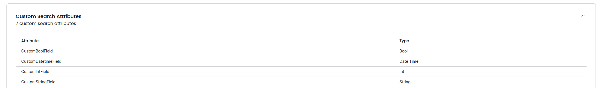

# Money Transfer

This is a typescript adaption of the moneytransfer example from the Temporal Java SDK

### Create Custom Search Attributes
The money transfer app requires the following search attributes:
- CustomBoolField
- CustomDateTimeField
- CustomIntField
- CustomStringField

These can be added by using tctl (local Temporal) or via tcld or the UI (cloud Temporal).

### Running this sample locally

1. Make sure Temporal Server is running locally (see the [quick install guide](https://docs.temporal.io/docs/server/quick-install/)).
1. `npm install` to install dependencies.
1. `npm run start.watch` to start the Worker.
1. In another shell, `npm run webclient` to run the web application.
1. Using the webapp, you can create new payments, payments over 1000 euros require an approval. Use the app to approve before expiration.
1. Use encryption by setting ENCRYPT_PAYLOAD to true

### Running this sample with Temporal Cloud

1. Set the following ENV Variables
    - TEMPORAL_NAMESPACE with the name of your Cloud namespace
    - TEMPORAL_HOST_URL with the URL of your Cloud namespace
    - MTLS must be set to true
    - TEMPORAL_TLS_CERT path to your client cert file
    - TEMPORAL_TLS_KEY path to your client cert key file
1. `npm install` to install dependencies.
1. `npm run start.watch` to start the Worker.
1. In another shell, `npm run webclient` to run the web application.
1. Using the webapp, you can create new payments, payments over 1000 euros require an approval. Use the app to approve before expiration.
1. Use encryption by setting ENCRYPT_PAYLOAD to true

DEMO SCENARIO

1. Simple transaction
1. Introduce an error in activity 
    - Uncomment the error in the deposit activity, show the error handling in the UI
    - Patch code, show that the workflow is resumed and the transfer is executed
1. Introduce business logic (if > 1000, reject)
    - You can change the amount in client.ts `args: ["myaccount", "friendaccount",  nanoid(), 2500 ]`
1. Introduce long running business logic with signal, Signal (if > 1000, wait 30s for approval)
    - Execute without signal, show timeout with automated rejection
    - Execute with signal using clientSignal.ts with the correct workflowId, show that the transfer is executed
